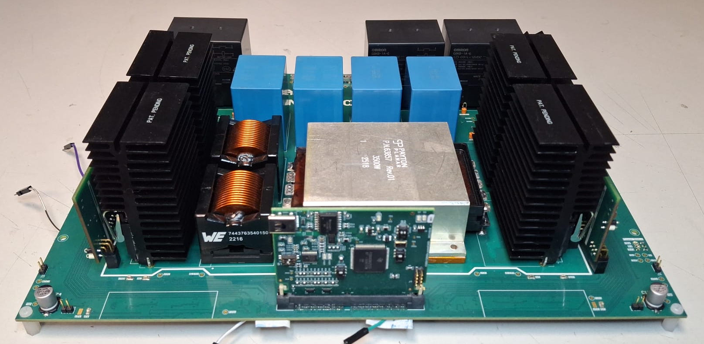
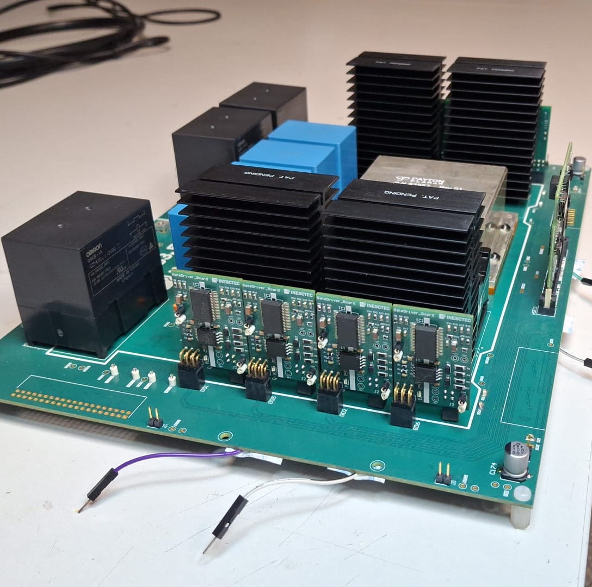
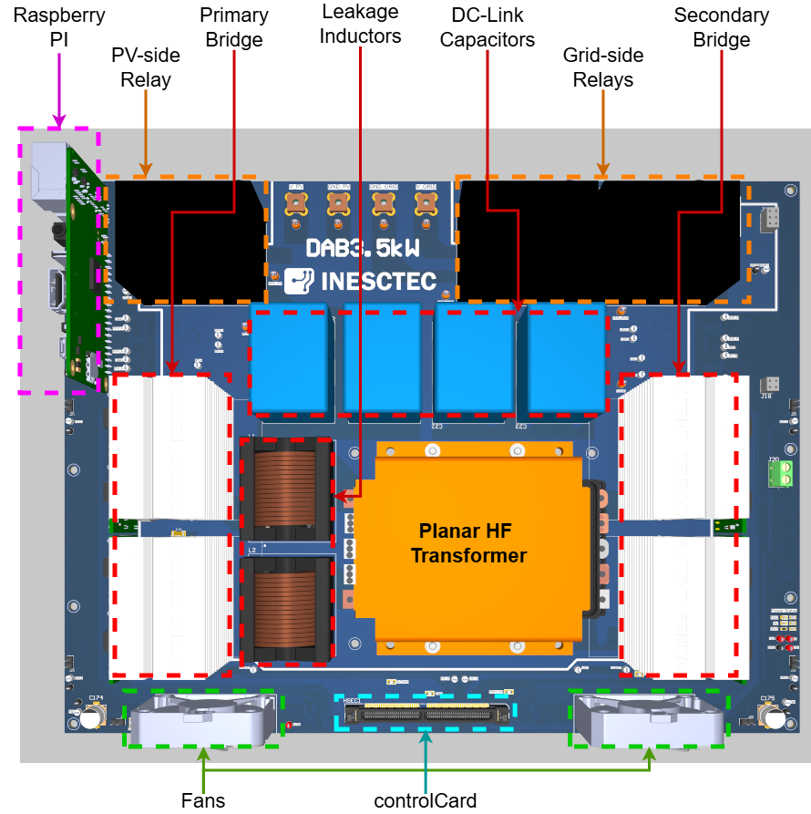
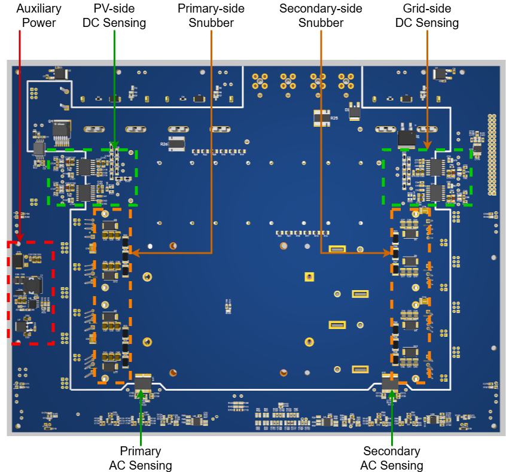
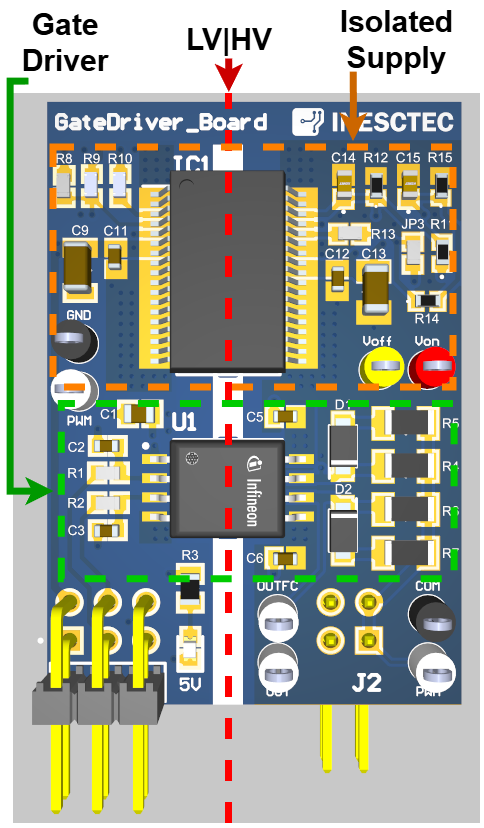

# 3.5 kW Dual Active Bridge Converter 

DAB prototype developed as part of the Master's thesis, *"Design and Implementation of a Dual Active Bridge DC-DC Converter for Photovoltaic Integration in a DC Microgrid"*, awarded the maximum grade (20/20) ([thesis](https://hdl.handle.net/10216/174149)).

| Parameter | Value |
|:---|---:|
| Rated power | 3.5 kW |
| Input voltage | 200–450 V |
| Input current (DC) | 0–9 A |
| Output voltage | 700 V nominal (640–760 V) |
| Output current (DC) | 0–5 A |
| Maximum efficiency | >90% |
| Primary transformer current | 22 A RMS / 34 A pk-pk |
| Switching frequency | 100 kHz |
| Phase-shift range | 0–90° |
| Transformer turns ratio | 6:21 |
| Leakage inductance | 30.21 μH (2 × 15 μH) |
| Primary SiC MOSFET | IMZA65R026M2H (650 V) |
| Secondary SiC MOSFET | IMZC120R078M2H (1200 V) |
| Gate driver | Infineon 1ED3250MC12H |
| Control board | TI TMS320F280039C ControlCARD |
| Cooling method | Heatsink / air |
 
## Prototype

## PCB 3D Views

#### Power board

#### Gate driver board

  

